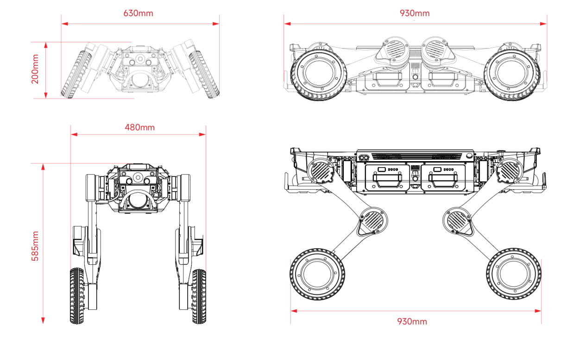

1.1 产品概述
============

智元仿生四足机器人 D1 Max是一款轮足式仿生四足机器人， 具备自重轻、负载大、续航长、防护强、运动灵活稳定等优势。机器狗每条腿配备3个关节电机和1个轮毂电机，配备光学相机、激光雷达、超声波雷达、IMU、RTK模块等传感设备，内部搭载高算力平台，用于实现运动控制、自主导航定位、环境侦测等功能，提供丰富的供电和通信接口，支持多品类的任务载荷拓展。

