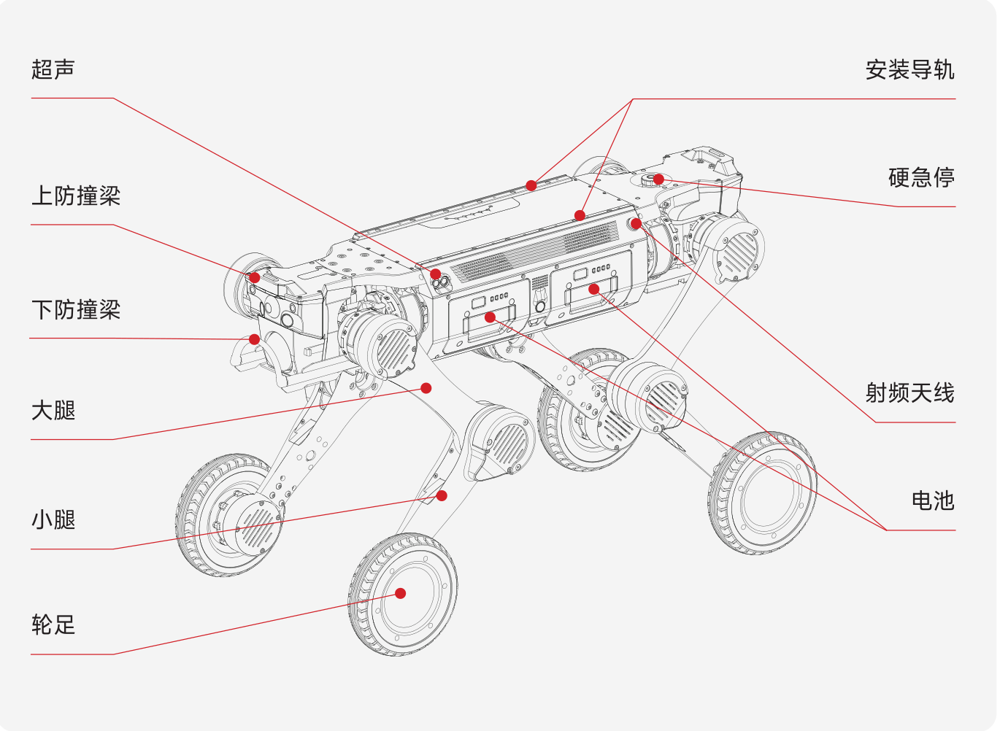
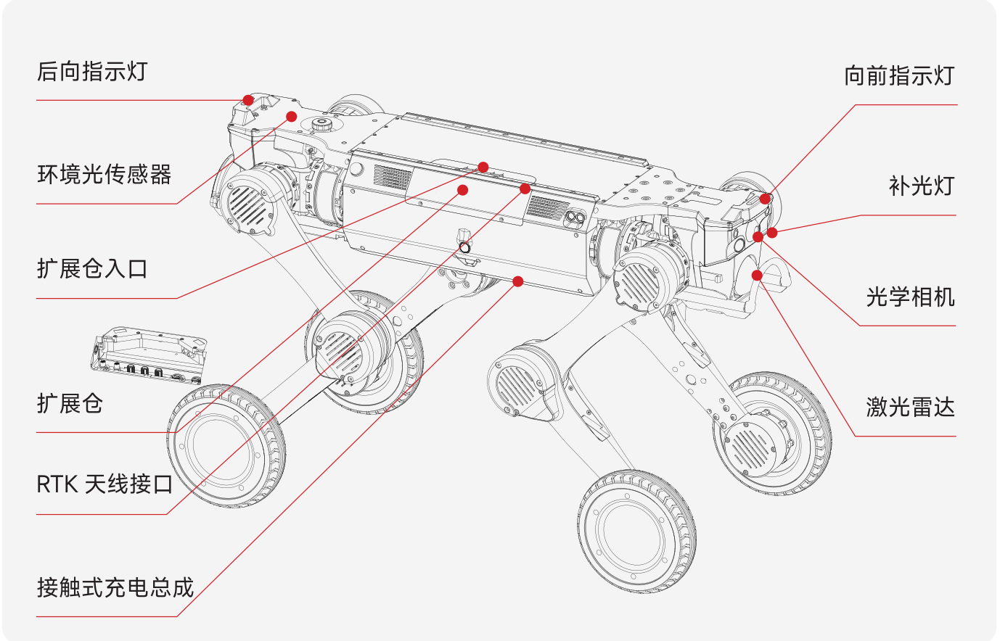

1.3 产品参数
============

| 分类         | 规格                 | 说明                     |
|-------------|----------------------|-------------------------|
| 基础信息     | 站立尺寸               | 930mm * 480mm * 585mm |
|             | 趴下尺寸               | 930mm * 630mm * 200mm |
|             | 整机重量(含电池)  | 41kg |
|             | 工作温度   | -20°~55° |
|             | 防护等级   | IP67 |
|             | 电池模组               | 504.9Wh*2，双电池，支持快拆快换，支持热插拔 |
|             | 充电时长   | <1.5h |
|             | 续航时间   | 空载5±0.5h,满载3.5±0.5h |
| 性能参数     | 最大速度   | 6m/s |
|             | 稳定负载   | 25kg |
|             | 连续攀爬台阶高度 | 25cm |
|             | 极限跨越障碍高度 | 80cm |
|             | 极限跨越沟壑宽度 | 80cm |
|             | 带负载跨越高度   | 50cm |
|             | 最窄通过宽度    | 50cm |
|             | 最大爬坡角度    | 45°  |
|             | 最窄掉头宽度    | 支持原地掉头，支持前后向切换 |
|             | 算力主控 | 157 Tops/Nvidia Orin NX 16GB |
| 传感单元     | 激光雷达 | 前后各1个96线激光雷达(Airy96线)、覆盖角度360°*90°、覆盖直径范围120m |
|           | 广角相机 | 前后各1个FPV相机，工业级800万像素，视场角：DFOV122°，HFOV111°，VFOV70° |
|            | 补光灯 | 补光灯*4，FPV相机左右各1个。照射距离≥3m |
|            | IMU | 车规级IMU*1 |
|            | 超声波传感器 | 左右各一个超声波，支持5m以内的障碍物识别 |
|            | RTK模块 | GNSS RTK*1 |
|            | 麦克风扬声器 | 部分版本支持 |
|            | 光照传感器 | 部分版本支持 |
| 功能列表    | 运动性能 | 具备踏步、滑行、匍匐等姿态，能够前后左右直线移动、原地旋转等，支持膝关节姿态变换； 支持在砂石路面、柏油路面、草地、沙土地面、森林地面、建筑废墟等各类路面行走；|
|            | 轮\足快换 | 支持轮足、点足快换 |
|            | 实时图像传输 | 支持 |
|            | OTA升级 | 支持 |
|            | 二次开发 | 支持，提供SDK开发包，机器人模型提供3D数模和urdf文件用于仿真 |
|            | 供电接口 | 5V、12V、24V、48V，最大输出功率480W |
|            | 通讯接口 | 千兆网口*2、USB3.0*2、串口*1 |
| 通信        | WIFI通信 | 支持|
|            | 蓝牙 | 支持 |
|            | 射频通信 | 支持 |
| 配件        | 适配器充电座 | 标配 |
|            | 带屏遥控器 | 标配，遥控距离700-1000m |
|            | 自主充电桩 | 选配 |
|            | 航空包装箱 | 标配 |
| 其他        | 保修期 | 1年 |

**注：以上参数为实验室测试数据，实际表现可能因使用环境、操作方式等因素有所差异，请以实际为准**

-  关节参数

| 部位         | 参数                 | 数值                     |
|-------------|----------------------|-------------------------|
| 髋部滚转关节(hip_roll) | 最大扭矩 | 150N.m |
|             | 最大转速 | 190RPM |
|             | 重量 | 0.93kg |
|             | 关节限位 | -39.9°~30° |
| 髋部俯仰关节(hip_pitch) | 最大扭矩 | 150N.m |
|             | 最大转速 | 190RPM |
|             | 重量 | 0.93kg |
|             | 关节限位 | -140°~140° |
| 膝部俯仰(knee_pitch) | 最大扭矩 | 150N.m |
|             | 最大转速 | 190RPM |
|             | 重量 | 0.93kg |
|             | 关节限位 | -160°~160° |
| 足端(foot) | 最大扭矩 | 33N.m |
|             | 最大转速 | 1200RPM |
|             | 重量 | 1.275kg |
|             | 半径 | 9cm |
|             | 关节限位 | -180°~180° |