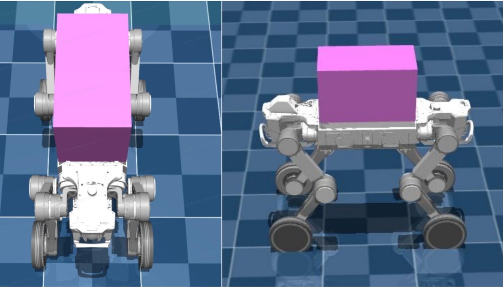

1.4 载荷上装
============

1.4.1 负载安装孔位图
-------------------------

机器狗背部的空间平整，负载25-30kg，背部部署有双导轨，两条导轨上有14个M4孔位支持上装载荷便捷安装，双导轨具体尺寸如下

- **机器人加装负载后，仅支持基础运动模式，请勿在加装负载后使用高台模式** 
- **当在机器人背部加装载荷时，机器人的运动性能可能会受影响，请务必在加装前向售后人员咨询相关事宜**

1.4.2 重心限制
-------------------------

为避免D1 Max机身上加装上装载荷之后，在各类地形运动过程中，腿部与上装载荷发生碰撞干涉，对D1 Max的上装空间给出如下推荐示意，具体尺寸为长40cm，宽22cm，高24cm，位置在机身背部居中位置，如下图所示：

