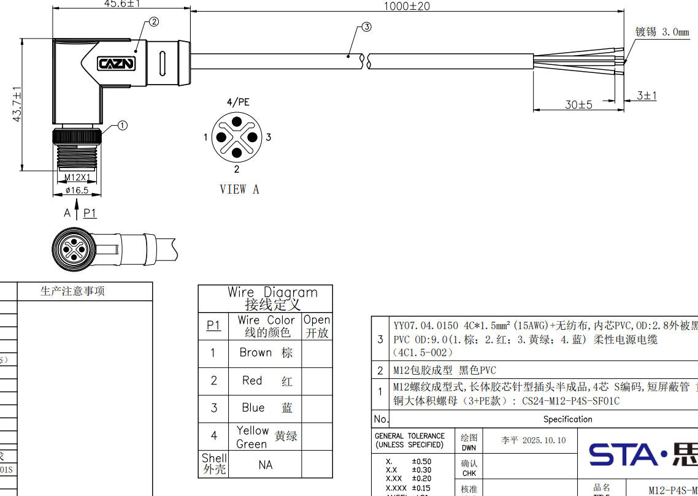
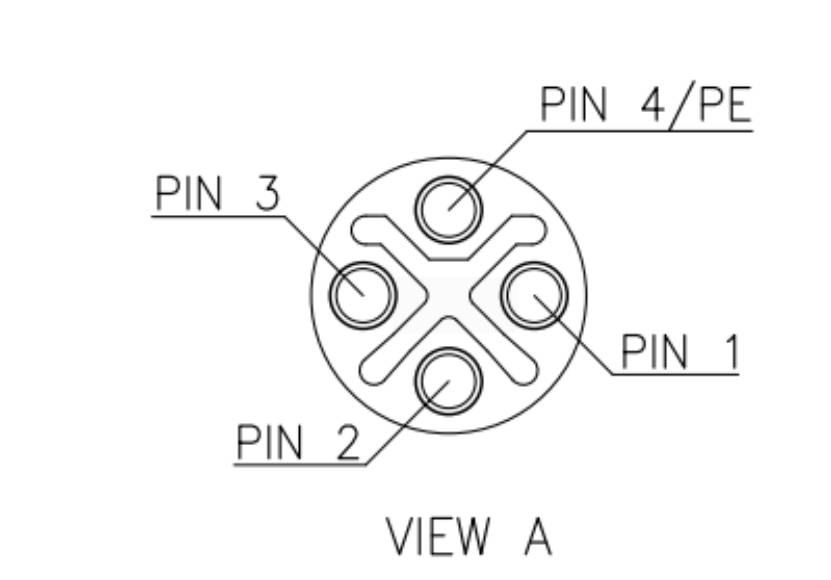
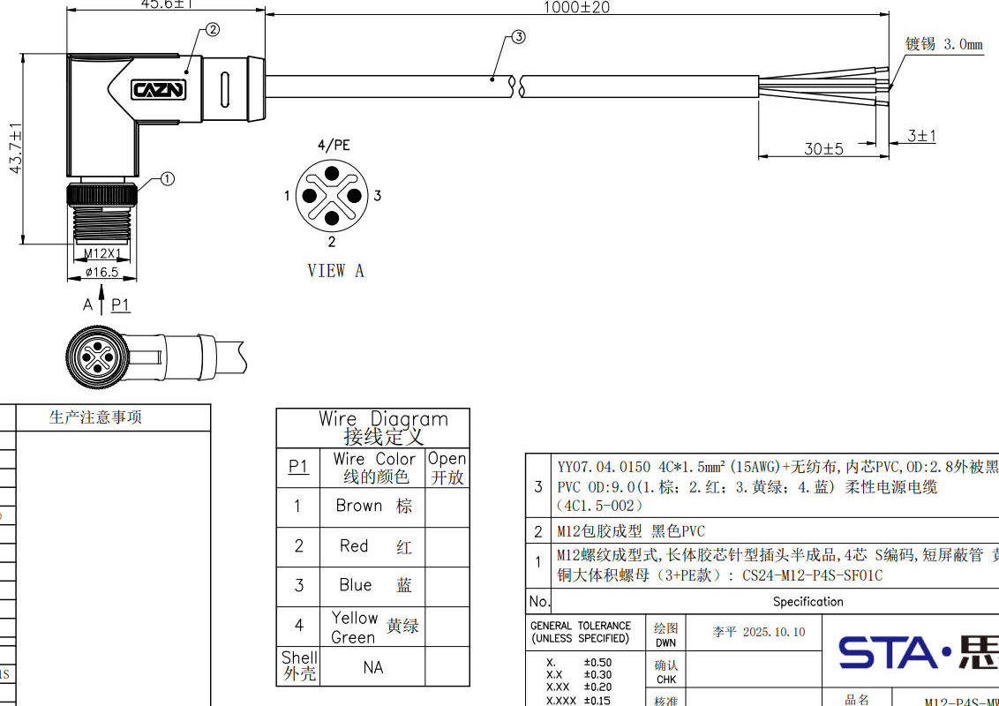
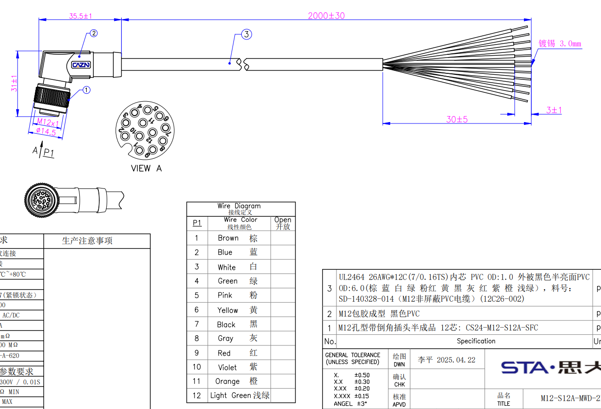
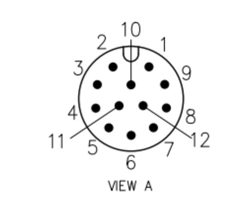
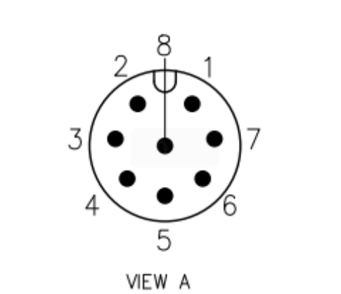
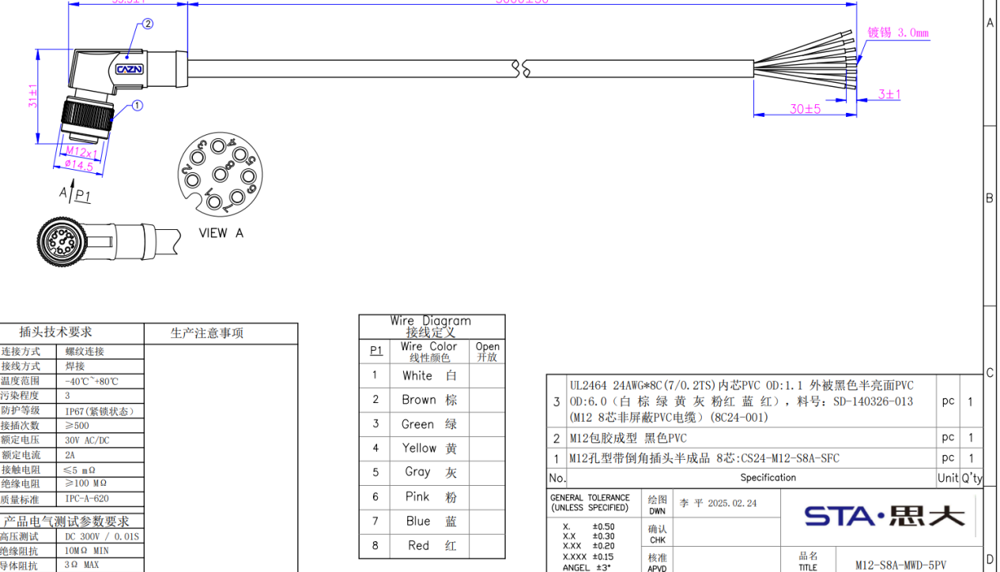
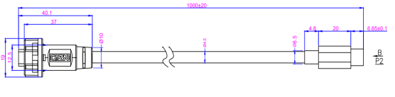

1.5 电气拓展接口
============

| 序号 | 接口名称 |
|------|----------|
| 1 | 48V(10A)  |
| 2 | 24V(20A)  |
| 3 | 24V(3A)+网口 |
| 4 | 12V(5A)+网口 |
| 5 | 串口（RS232 x1、RS485 x1、SBUS x2、PPS x1） |
| 6、7 | USB3.0（5V、1A） |
| 8 | RTK天线接口 |
| 9 | 拓展仓按键 |

- 所有供电接口的供电总功率在 480W 以内；
- 有航插头配备防护盖，以确保 IP67，不用的航插头务必盖好防护盖；
- 扩展仓按键用于控制扩展接口的供电，在进行上装接线时，务必先关闭扩展仓的电源。

**航插扩展功能接口说明：**

| 设备名称 | 设备路径 |
|---------|----------|
| RS232 | /dev/ttyCH9344USB4 |
| RS485 | /dev/ttyCH9344USB5 |
| SBUS1 | /dev/ttyCH9344USB2 |
| SBUS2 | /dev/ttyCH9344USB3 |

1.5.1 电源口48V(10A)
------------------------

- 航插母头

| 航插名称 | 48V 10A |
|---------|----------|
| 板端航插型号 | M12-S4S-GPFM16-135-CS24044 |
| 线序 1(棕) | GND |
| 线序 2(红) | 48V |
| 线序 3(蓝) | 48V |
| 线序 4(黄绿) | GND |

- 对插线束

1.5.2 电源口24V(20A)
------------------------

- 航插母头

| 航插名称 | 24V 20A |
|---------|----------|
| 板端航插型号 | M12-S4S-GPFM16-135-CS24044 |
| 线序 1(棕) | GND |
| 线序 2(红) | 24V |
| 线序 3(蓝) | 24V |
| 线序 4(黄绿) | GND |

- 对插线束

1.5.3 网口(24V)
------------------------

- 航插母头

| 航插名称 | 网口+24V |
|---------|----------|
| 板端航插型号 | M12-P12A-GPFM12 |
| 线序 1(棕) | GND |
| 线序 2(蓝) | 24V |
| 线序 3(白) | 24V |
| 线序 4(绿) | 网口A+ |
| 线序 5(粉) | 网口A- |
| 线序 6(黄) | 网口B+ |
| 线序 7(黑) | 网口B- |
| 线序 8(灰) | 网口C+ |
| 线序 9(红) | 网口C- |
| 线序 10(紫) | GND |
| 线序 11(橙) | 网口D+ |
| 线序 12(浅绿) | 网口D- |

- 对插线束

1.5.4 网口(12V)
------------------------

- 航插母头

| 航插名称 | 网口+12V |
|---------|----------|
| 板端航插型号 | M12-P12A-GPFM12 |
| 线序 1(棕) | GND |
| 线序 2(蓝) | 12V |
| 线序 3(白) | 12V |
| 线序 4(绿) | 网口A+ |
| 线序 5(粉) | 网口A- |
| 线序 6(黄) | 网口B+ |
| 线序 7(黑) | 网口B- |
| 线序 8(灰) | 网口C+ |
| 线序 9(红) | 网口C- |
| 线序 10(紫) | GND |
| 线序 11(橙) | 网口D+ |
| 线序 12(浅绿) | 网口D- |

- 对插线束

1.5.5 串口
------------------------

- 航插母头

| 航插名称 | 串口（RS232、RS845、SBUS*2、PPS） |
|---------|----------|
| 板端航插型号 | M12-P8A-GPFM12 |
| 线序 1(白) | PPS |
| 线序 2(棕) | SBUS1 |
| 线序 3(绿) | SBUS2 |
| 线序 4(黄) | RS485A |
| 线序 5(灰) | RS485B |
| 线序 6(粉) | RS232_TX |
| 线序 7(蓝) | RS232_RX |
| 线序 8(红) | GND |

- 对插线束

1.5.6 USB口
------------------------

- 航插母头

| 航插名称 | USB3.0+5V  两个 |
|---------|----------|
| 板端航插型号 | E10B-FT3-PPF |
| 线序定义 | 无 |

- 对插线束

