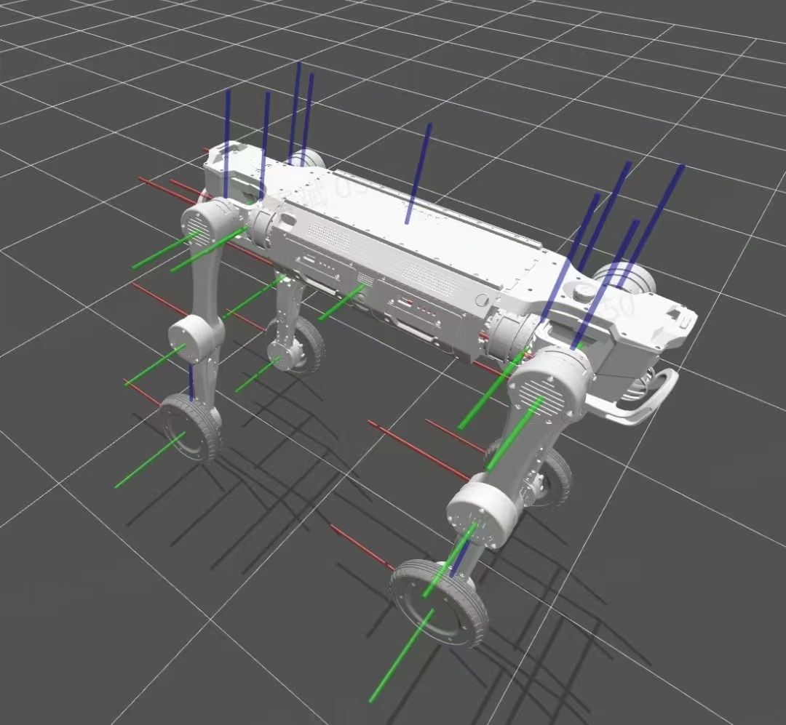

2.10 传感设备坐标定义
======================

| 传感器名称 | 传感器x坐标(相对机身BASE原点)(单位mm) | 传感器y坐标 | 传感器z坐标 | 备注 |
|----------|------------------------------|----------|--------------|-------|
| IMU_ICM42688(运控用) | 0 | 0 | 36.2 | |
| IMU_LUA300C(车规级) | 0 | 0 | 56.9 |  |
| 前激光雷达AIRY | 404.3 | 0 | -37.7 | 详见规格书 |
| 前摄像头IMX415 | 412.3 | 0 | 37.8 | 详见规格书 |
| 右前补光灯 | 420.3 | -30.9 | 28.3 | 照射范围 120° |
| 左前补光灯 | 420.3 | 30.9 | 28.3 | 照射范围 120° |
| 后激光雷达AIRY | -404.3 | 0 | -37.7 | 详见规格书 |
| 后摄像头IMX415 | -412.3 | 0 | 37.8 | 详见规格书 |
| 右后补光灯 | -420.3 | -30.9 | 28.3 | 照射范围 120° |
| 左后补光灯 | -420.3 | 30.9 | 28.3 | 照射范围 120° |
| 右前超声波雷达RADAR A22 | 179.2 | -100.2 | 50 | 详见规格书 |
| 左前超声波雷达RADAR A22 | 179.2 | 100.2 | 50 | 详见规格书 |

当各个关节均为零度时，各坐标系如下图。红色为 x 轴，绿色为 y 轴，蓝色为 z 轴。关节的旋转轴和旋转正方向请参考下图

