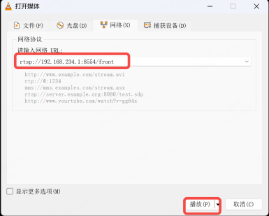

4.1 视频流数据
====================

前后广角相机的视频分别以Gstreamer方式推流到以下URL:
```
前置摄像头： rtsp://192.168.234.1:8554/front
后置摄像头： rtsp://192.168.234.1:8554/back
```
默认会在遥控器侧拉流显示实时画面，可通过 VLC 或者 ffplay 进行预览和调用，例如：<br>
- **case1:在 windows 电脑连接四足机器人 wifi，可通过 VLC 软件进行视频流数据查看：**
    * step1:打开 vlc，点击"媒体-->打开网络串流"
    
    * step2:输入设备推流地址：
    `rtsp://192.168.234.1:8554/front`<br>
    
    * step3:预览画面<br>
    

- **case2:ubuntu 电脑连接四足机器人 wifi，在终端中输入以下指令进行视频流获取：**
```
ffplay rtsp://192.168.234.1:8554/front
ffplay rtsp://192.168.234.1:8554/back
```
注意：若以低延迟获取视频流数据，可按如下方法获取：
```
gst-launch-1.0 rtspsrc location=rtsp://192.168.234.1:8554/front latency=0 ! 1rtph264depay ! h264parse ! avdec_h264 ! videoconvert ! videoscale ! video/x-raw,width=1280,height=720 ! autovideosink
```