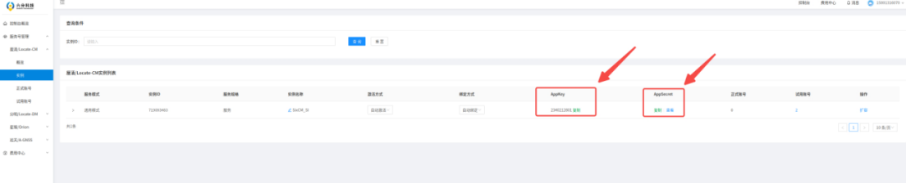
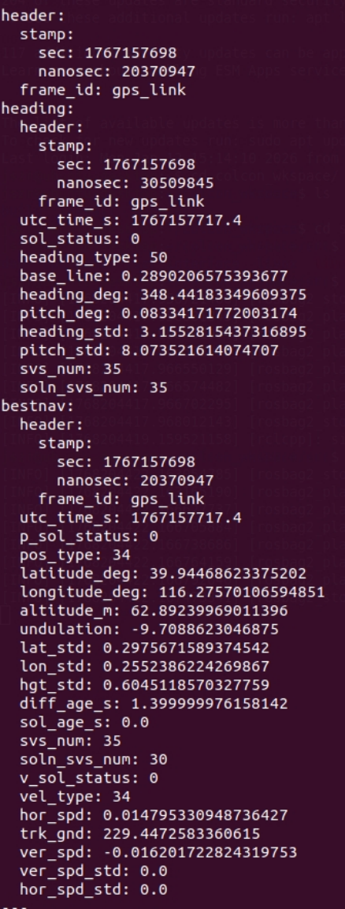

4.4 RTK数据
================

4.4.1 RTK简介
---------------------

LK1220D 是六分科技自研的一款工规级全频高精度定位定向模组，最多支持 1040 卫星通道,支持双天线接入。模组可内置高精度 NRTK&定向算法，且具备优秀的抗干扰能力，通过基带内置多频窄带抗干扰单元，提升复杂电磁环境下的信号接收和处理性能。<br>
D1 Max设备内部预留RTK拓展接口，且已安装驱动，如需使用RTK服务，需外接天线(SMA接头)并开通RTK服务账号 ，另外需要通过4G模组访问外网，方可正常使用RTK功能。推荐的rtk天线型号：北天BT560。

```
定位精度：
水平定位精度: 单点定位 1.5m; 差分定位2~3cm;  RTK精度：1cm+1ppm;
高程定位精度: 单点定位2.5m; 差分定位4~5cm;  RTK精度：1.5cm+1ppm;
注1：单点定位需加装天线；差分定位需加装天线并开通RTK服务账号；
注2：RTK精度测量条件：需要高精度天线，空旷区域，距离基站1km内;
```

4.4.2 获取六分RTK服务
----------------------

使用从注册的六分账户和密码登录到官网
网址：<https://www.sixents.com/login>
- 登录进控制台

- 获取AK和AS


4.4.3 NX侧RTK服务配置
----------------------

- 登录进入NX<br>
首先需要连接机器狗的WIFI，密码默认是 12345678

```
ssh robot@192.168.168.100   #密码是 1
```

- 打开配置文件

配置文件路径：`sudo vim /ota/sixents_config.ini`

```
配置文件说明
[sixents_sdk]
sdk_ak = 
sdk_as = 
sdk_dev_id = 
sdk_dev_type = 
```

  * sdk_ak: 设置您购买服务实例的 AK
  * sdk_as: 设置您购买服务实例的 AS
  * sdk_dev_id: 设置您的设备 ID 或 SN（自定义）
  * sdk_dev_type: 设置您的设备类型（自定义）

**注意：sdk_dev_id 和 sdk_dev_type 是和 账户唯一绑定的，之后更改其他的需要去官网解绑**

4.4.4 RTK ROS2接口定义
----------------------

- rtk话题名称

rtk对应的话题为：`/rtk_pvh`



- 数据说明

| 类别 | 字段 | 说明 |
|------|------|------|
| heading | utc_time_s | heading UTC时间 |
|         | sol_status | 解的状态<br>0：已解出<br>1：观测量不足<br>2：未收敛<br>4：协方差矩阵的迹超过最大值(迹＞1000 米) |
|         | heading_type | 定位类型<br>0：不进行解算<br>16：单点定位<br>17：伪距查分定位<br>34：浮点解<br>50：整数解<br>pose_type是50说明是精准定位 |
|         | base_line | 基线长度，单位米(0~3000) |
|         | heading_deg | 航向角，单位度(0~360) |
|         | pitch_deg | 俯仰角，单位度(±90) |
|         | heading_std | 航向角标准差，单位度 |
|         | pitch_std | 俯仰角标准差，单位度 |
|         | sys_num | 跟踪的卫星数 |
|         | soln_svs_num | 参与解算的卫星数 |
| bestnav | utc_time_s | bestpos UTC时间 |
|         | p_sol_status | 解的状态 |
|         | pos_type | 定位类型 |
|         | latitude_deg | 纬度，单位度 |
|         | longitude_deg | 经度，单位度 |
|         | altitude_m | 海拔高，单位米 |
|         | undulation | 大地水准面差距，大地水准面与 WGS84 参考椭球面的差值，单位米 |
|         | lat_std | 纬度标准差，单位米 |
|         | lon_std | 经度标准差，单位米 |
|         | hgt_std | 高度标准差，单位米 |
|         | diff_age_s | 差分龄期，单位秒 |
|         | sol_age_s | 解的龄期，单位秒 |
|         | svs_num | 跟踪的卫星数 |
|         | soln_svs_num | 参与解算的卫星数 |
|         | v_sol_status | 解的状态 |
|         | vel_type | 定位类型 |
|         | hor_spd | 水平方向对地速度，单位米/秒 |
|         | trk_gnd | 相对于真北的实际对地运动方向，单位度 |
|         | ver_spd | 垂直方向速度，单位米/秒。正值表示方向向上，负值表示方向向下 |
|         | ver_spd_std | 垂直方向速度标准差(未填写) |
|         | hor_spd_std | 水平方向对地速度标准差(未填写) |

4.4.5 获取RTK数据
-----------------------

```
ssh robot@192.168.168.100   
ros2 topic echo /rtk_pvh --once
```