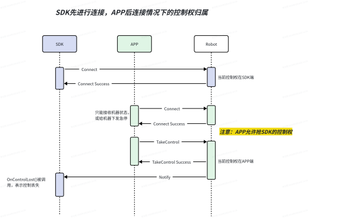
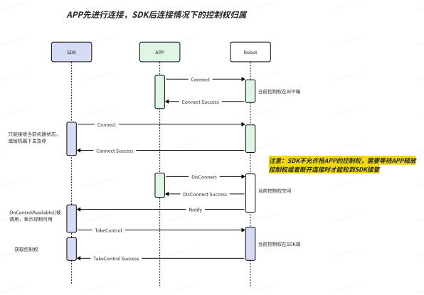

5.1 控制权切换说明
=====================

**功能说明：**
控制权切换功能主要用来在进行sdk控制阶段，当出现一些紧急情况或需要人工介入处理的场景。

**控制原则：**
- 在同一时间，不支持遥控器和sdk同时进行控制；
- sdk控制阶段，可以在遥控器端APP进行控制权的抢夺，并可在遥控器端触发软急停；
- 遥控器控制阶段，sdk无法获得控制权，但可通过sdk下发急停指令并获取设备状态；

SDK先链接，APP后链接

APP先链接，SDK后链接

