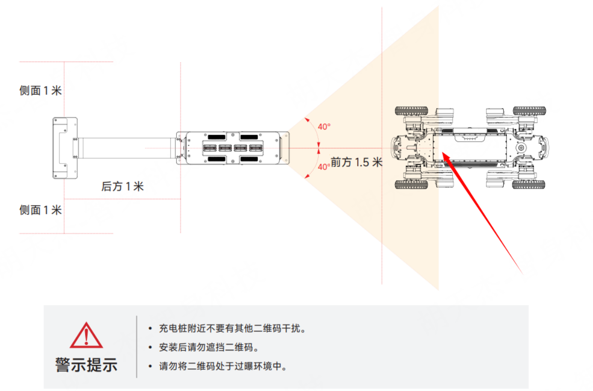

5.2 自主回充说明
===================

**版本要求：**
rk3588版本为: 0.2.4，Orin NX固件版本为: 0.4.5

**使用要求：**
需搭配充电桩进行使用，安装说明详见“智元D1 Max自主充电产品说明书”，目前支持"无图回充"，即将四足机器人D1 Max设备正对充电桩，设备头部距离充电桩1.5m左右，确保在相机视野中可完整看到充电桩的二维码。



**Deme运行**

```
# 进入 C++ 演示目录
cd example

# 创建构建目录
mkdir build && cd build

#配置并编译项目
cmake ..
make -j6

#运行demo示例
./control 192.168.168.168 8081 192.168.168.100 10010
```