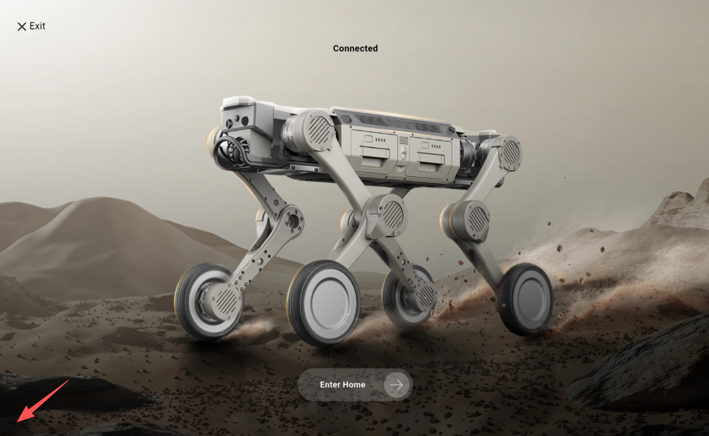

5.4 日志查看
======================

- **遥控器报错信息查看**<br>
连续点击主页左下角位置



打开设置中心，可查看设备异常日志


- **设备log查看**<br>
最近1次设备启动后的log路径(RK&NX)：`/home/robot/robot_launch_log`<br>
最近6次设备启动后的log路径(RK&NX)：`/userdata/log/`<br>
自主回充日志路径(NX)：`/tmp/log/alg_data`

```
scp -r robot@192.168.234.1:/userdata/log .  #拉取最近6次设备启动后的所有日志
scp -r robot@192.168.234.1:/home/robot/robot_launch_log .  # 拉取当前设备启动后的日志
```

